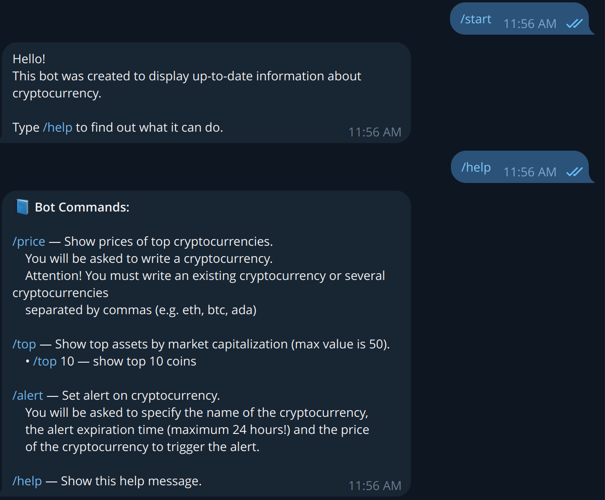
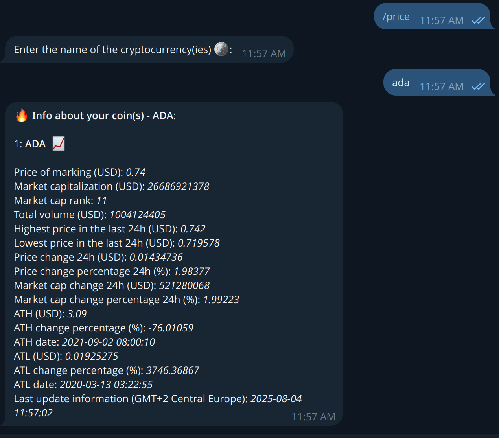
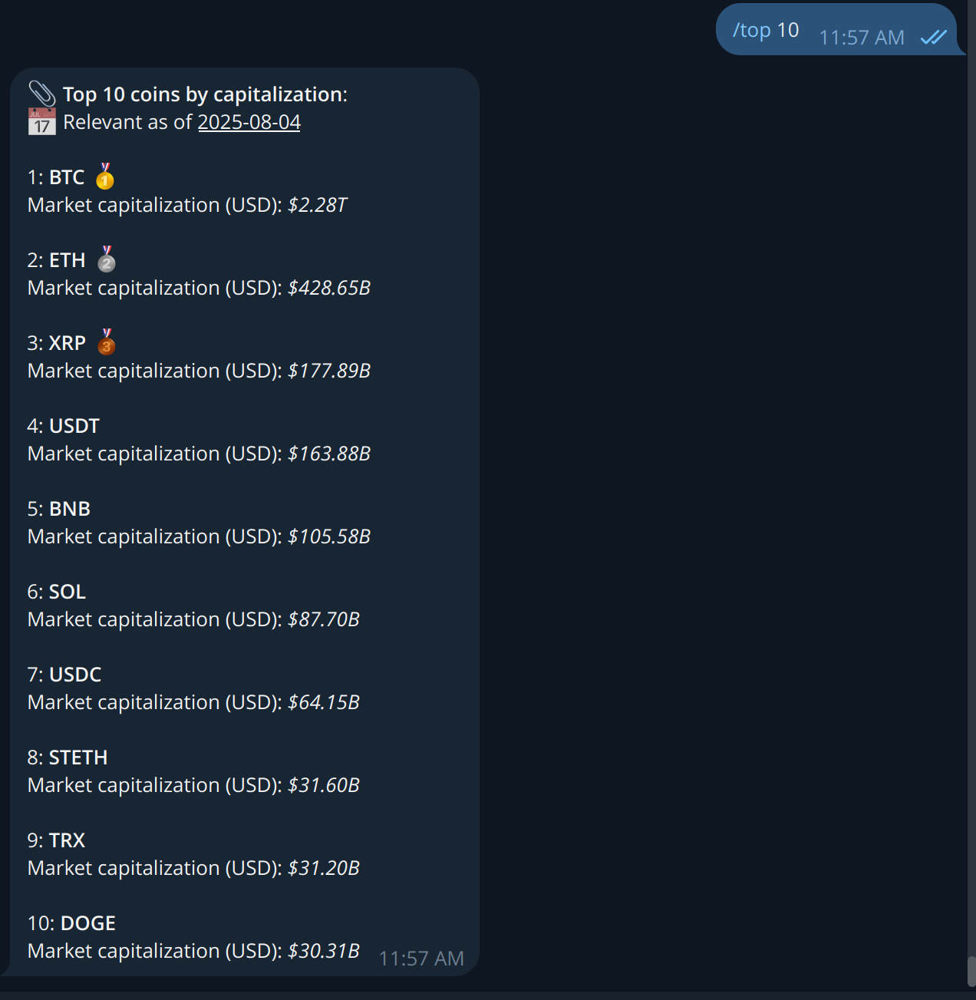
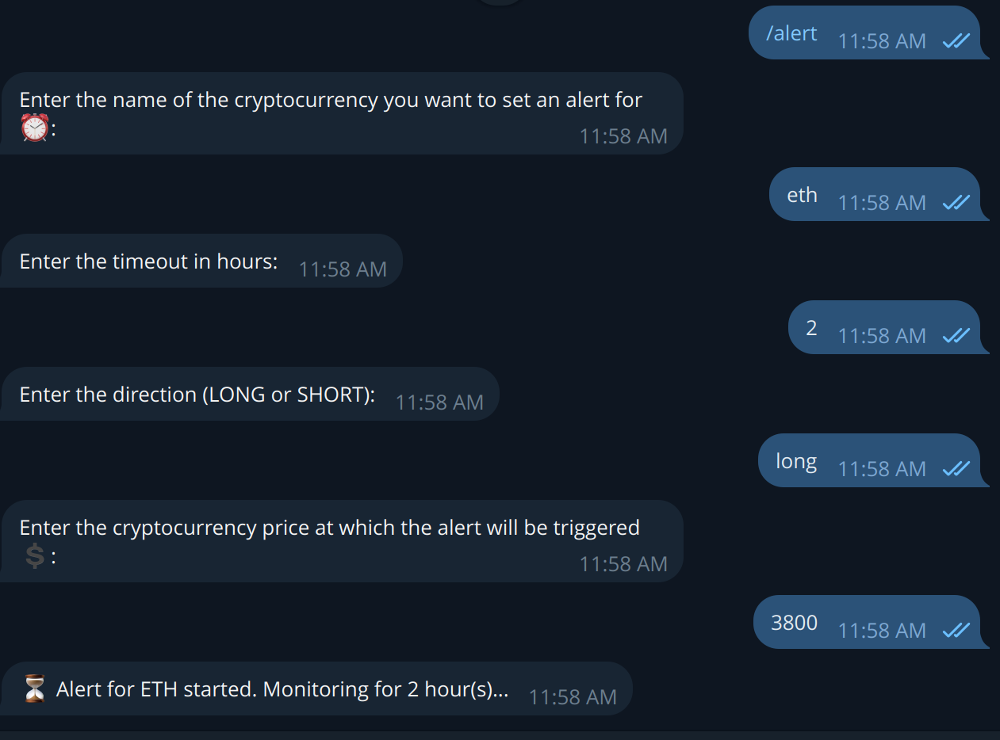

# Crypto info TgBot

Crypto Alert Bot is a Telegram bot that provides real-time cryptocurrency data, top market rankings, and customizable
price alerts with support for LONG/SHORT directions and timezone-aware timestamps.

## Features

- 🔍 Real-time coin data with 24h price change
- 🥇 Top cryptocurrencies by market capitalization
- ⏰ Custom price alerts with LONG/SHORT direction
- 🧾 Clean HTML-formatted messages for Telegram

## Technologies

* aiogram 3.21
* requests
* asyncio

## Installation

1. Clone the repository
    ```bash
    git clone https://github.com/vitaleoneee/crypto-info-tgbot.git

2. Navigate to the project folder:
   ```bash
   cd crypto-info-tgbot
3. Create and activate a virtual environment:
    ```bash
   python -m venv .venv
   source .venv/bin/activate      # for Linux/macOS
    .venv\Scripts\activate         # for Windows
4. Install dependencies:
   ```bash
   pip install -r requirements.txt

5. Create a .env file based on the example:
   ```bash
   cp .env.example .env

6. Specify variables in .env  
   You need to create a bot directly from the telegram @BotFather and insert the received token into the BOT_TOKEN
   variable.
    ```bash
    BOT_TOKEN=your_telegram_bot_token_here
7. Start the bot
    ```bash
    python main.py

## 📸 Screenshots

### 🔍 Base commands



### 💲 Price command



### 🏆 Top cryptocurrencies by market cap



### ⚙️ Alert command

